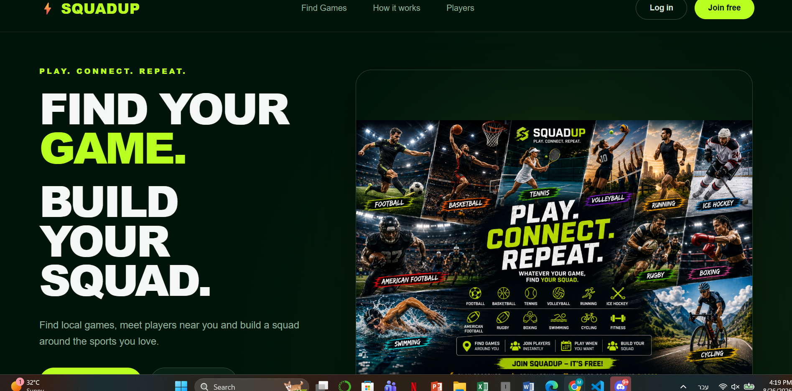

# ⚡ SquadUp

**Play. Connect. Repeat.**

SquadUp is a modern sports web application that helps players find local games, connect with other players, and build their squad.

Users can discover games by sport, join available games, or host their own.

---

## 🌐 Live Demo

👉 [Open SquadUp Live](https://squadup-malak.netlify.app)

---

## 📸 Project Preview



---

## ✨ Features

- 🔎 Find available sports games
- ➕ Host a new game
- 🤝 Join existing games
- ✏️ Edit game details
- 🗑️ Delete games
- 🎯 Filter games by sport
- 👥 Track available spots
- 🔐 Login and Register pages
- 📱 Responsive modern design
- 🌐 REST API integration with MockAPI

---

## 🏆 Supported Sports

SquadUp supports 12 sports:

- ⚽ Football
- 🏀 Basketball
- 🎾 Tennis
- 🏐 Volleyball
- 🏃 Running
- 🏒 Ice Hockey
- 🏈 American Football
- 🏉 Rugby
- 🥊 Boxing
- 🏊 Swimming
- 🚴 Cycling
- 🏋️ Fitness

---

## 🛠️ Technologies

- JavaScript (ES6+)
- React
- Vite
- React Router
- HTML5
- CSS3
- REST API
- MockAPI
- Git
- GitHub
- Netlify

---

## 🔄 API Operations

The application uses REST API operations to manage games:

| Method | Function |
|---|---|
| GET | Load games |
| POST | Create a new game |
| PUT | Update or join a game |
| DELETE | Delete a game |

---

## 📄 Pages

### 🏠 Home

Modern landing page introducing SquadUp and its sports community.

### 🔎 Find Games

Browse available games and filter them by sport.

### ➕ Host a Game

Create a new game by choosing the sport, location, date, level, and available spots.

### ✏️ Edit Game

Update information for an existing game.

### 🔐 Login & Register

Login and registration interface for SquadUp users.

---

## 🌐 REST API

SquadUp uses MockAPI as a REST API for storing and managing game information.

The application communicates with the API using JavaScript's `fetch()` function.

Supported operations include:

- Fetching available games
- Creating new games
- Updating existing games
- Joining games
- Deleting games

---

## 💻 Run the Project Locally

### 1. Clone the repository

```bash
git clone https://github.com/malakmrowat1-dot/SquadUp.git
```

### 2. Open the project

```bash
cd SquadUp/client
```

### 3. Install dependencies

```bash
npm install
```

### 4. Start the development server

```bash
npm run dev
```

Then open the local URL displayed in the terminal.

---

## 📦 Production Build

To create a production build:

```bash
npm run build
```

The production files will be generated inside the `dist` folder.

---

## 📁 Project Structure

```text
SquadUp/
│
├── client/
│   ├── public/
│   ├── src/
│   │   ├── assets/
│   │   ├── pages/
│   │   │   ├── Home.jsx
│   │   │   ├── Games.jsx
│   │   │   ├── CreateGame.jsx
│   │   │   ├── EditGame.jsx
│   │   │   ├── Login.jsx
│   │   │   └── Register.jsx
│   │   │
│   │   ├── App.jsx
│   │   ├── App.css
│   │   ├── index.css
│   │   └── main.jsx
│   │
│   ├── index.html
│   ├── package.json
│   └── vite.config.js
│
├── README.md
└── image.png
```

---

## 🎯 Project Goal

The goal of SquadUp is to make it easier for people to discover local sports activities and connect with other players.

Instead of searching for players manually, users can browse existing games, join available activities, or create their own game.

---

## 🚀 Deployment

The application is deployed using Netlify.

👉 [View Live Website](https://squadup-malak.netlify.app)

---

## 👩‍💻 Developer

Developed by **Malak Mrowat**

Computer Engineering Student

---

## 📌 Repository

[SquadUp GitHub Repository](https://github.com/malakmrowat1-dot/SquadUp)

---

## ⚡ SquadUp

**Find your game. Build your squad. Play together.**
